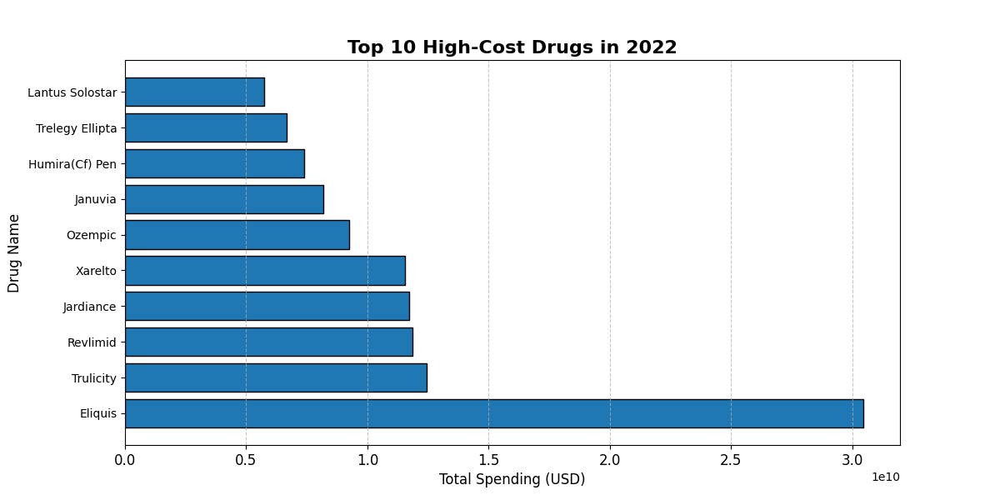

# Drug Pricing and Utilization Analytics using Medicare Data

This project involves comprehensive analysis of drug pricing and utilization trends from 2018 to 2022. The different steps include exploratory data analysis (EDA), outlier detection, cost per claim analysis, CAGR trends, and insights into healthcare spending. The dataset used contains information on drug spending, claims, and utilization metrics.

---

## Project Overview

### **Objective**
The goal of this project is to identify key trends, outliers, and actionable insights in drug pricing and utilization to inform healthcare policy and cost-management strategies.

### **Key Analyses**
1. **Exploratory Data Analysis (EDA):**
   - Basic statistics and missing value identification.
   - Initial exploration of spending trends.

2. **Spending Trends Over Time:**
   - Visualized spending trends from 2018 to 2022.

3. **CAGR Analysis:**
   - Identification of drugs with the highest Compound Annual Growth Rate (CAGR) from 2018 to 2022.

4. **Correlation Analysis:**
   - Examined relationships between claims, spending, and cost per claim in 2022.

5. **Outlier Detection:**
   - Detection of drugs with extreme values in spending and claims in 2022.

6. **Insights and Recommendations:**
   - Summarized findings with actionable recommendations.

## Dataset

The dataset used for this analysis is from Medicare:
- **Source:** [Medicare Part D Spending by Drug]

---


## Results and Visualizations

### **1. Top 10 expensive drugs in 2022**


### **2. Total spending per year (2018-2022)**


### **3. Spending Trends Over Time (2018-2022)**


### **4. CAGR Analysis (2018-2022)**
.png)

### **5. Correlation Analysis:**


### **6. Outlier Detection**


---

## Usage Instructions

1. **Clone the repository:**
   ```bash
   git clone https://github.com/username/Drug-Pricing-and-Utilization-Analysis-using-Medicare-Data.git
   ```

2. **Navigate to the project folder:**
   ```bash
   cd Drug-Pricing-and-Utilization-Analytics-using-Medicare-Data
   ```

3. **Install required dependencies:**
   ```bash
   pip install -r requirements.txt
   ```

4. **Run analysis scripts:**

---

## Insights and Recommendations

### **Key Insights**
1. **Total Spending in 2022:** $480,863,548,671.67
2. **Highest Spending Drug in 2022:** Eliquis ($15.22 billion).
3. **Top CAGR Drugs:**
   - Tigecycline (1054.20%)
   - Famotidine* (944.78%)
   - Acyclovir* (359.18%)
   - Potassium Chloride* (293.83%)
   - Abiraterone Acetate (270.45%).
4. **Cost per Claim Outliers:**
   - Revcovi ($337,266.86 per claim).
   - Cablivi ($193,748.05 per claim).
5. **Number of Outliers (Spending):** 90.

### **Recommendations**
1. **Cost Containment:** Reduce the cost of top outlier drugs to improve affordability.
2. **Monitor High-CAGR Drugs:** Keep track of rapidly increasing drugs like Tigecycline.
3. **Evaluate High Costs per Claim:** Assess cost-efficiency of drugs like Revcovi and Cablivi.
4. **Policy Adjustments:** Implement targeted policies to regulate spending on high-cost drugs.

---

## Contributing

Contributions are welcome! Please fork the repository and submit a pull request.

---

## License

[MIT License](LICENSE)

---

## Acknowledgments

- Data Source: [Medicare Part D Spending by Drug]
- Tools Used: Python (pandas, matplotlib, plotly), GitHub

